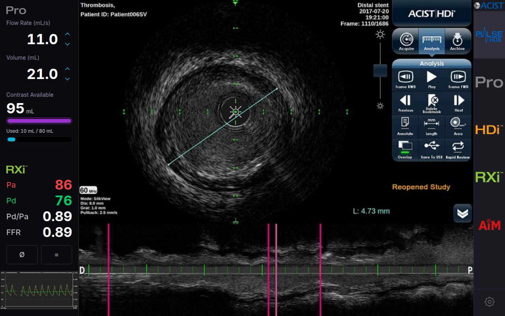

# Pulse Hub Mockup

## Current UI Screenshot



Next.js mockup app configured for easy local + Tailnet access.

## Quick Start

```bash
pnpm install
pnpm dev:tailnet
```

If you prefer npm:

```bash
npm install
npm run dev:tailnet
```

`dev:tailnet` does all of this for you:

- Binds to `0.0.0.0`
- Starts from port `3000`
- Automatically picks the next open port if `3000` is in use
- Prints localhost + Tailnet URLs

## Useful Commands

```bash
# Start from a different preferred port (still auto-falls forward if busy)
PORT=4300 pnpm dev:tailnet

# Standard Next.js dev mode (localhost default)
pnpm dev

# Build + run production
pnpm build
pnpm start
```

## Background Run (server style)

```bash
nohup pnpm dev:tailnet > /tmp/acist-pro-mockup.log 2>&1 &
tail -f /tmp/acist-pro-mockup.log
```

Stop the dev server:

```bash
pkill -f "next dev --hostname 0.0.0.0"
```
